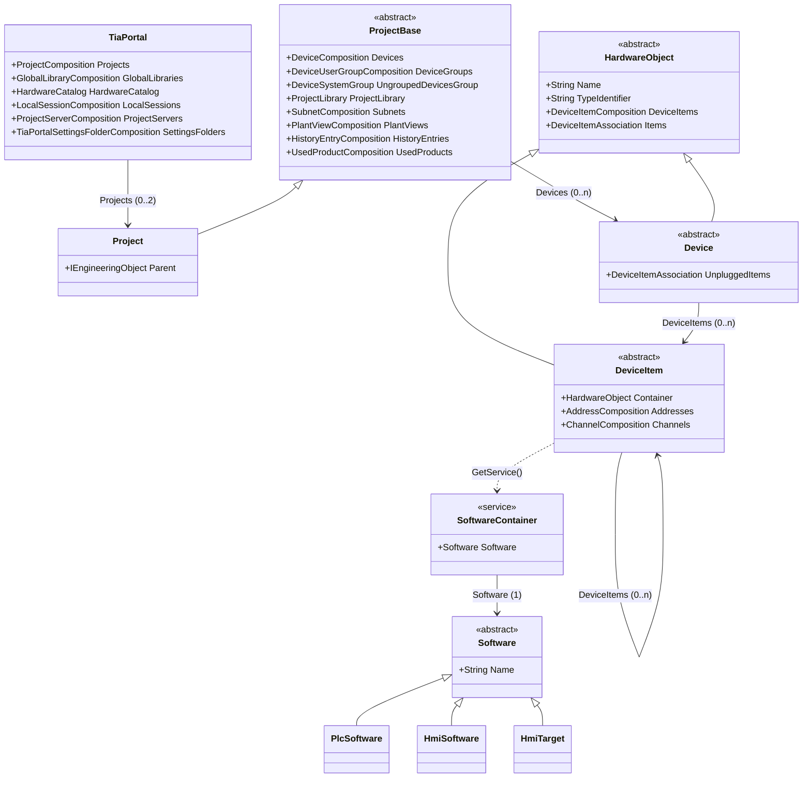
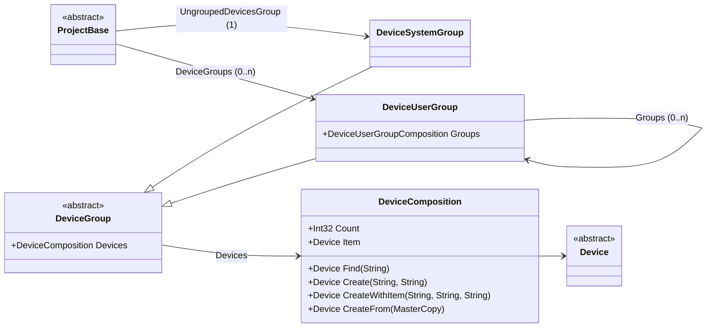
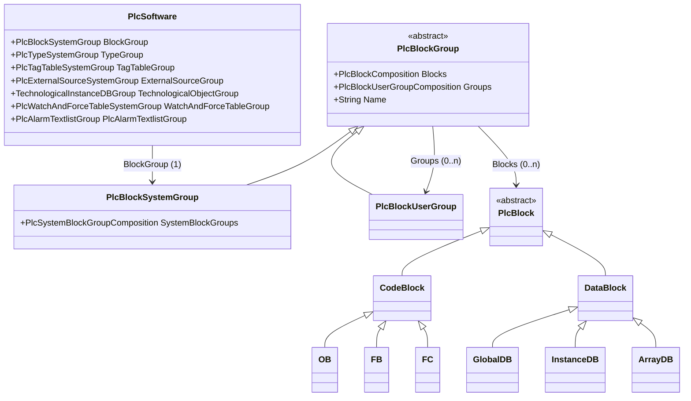
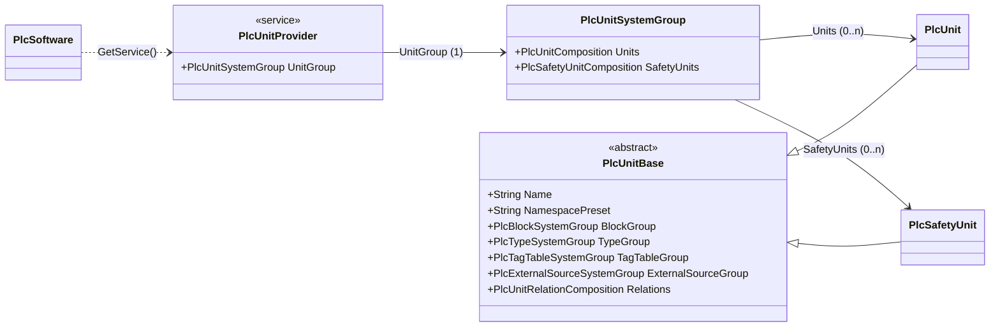
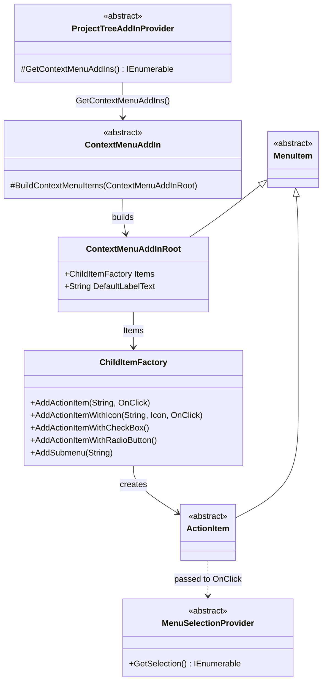

# TIA Portal V20 — Openness object model

**Read out of the assembly, not out of the documentation.** Every class, base type and
navigation property below came from `Siemens.Engineering.AddIn.dll` through
`Assembly.GetExportedTypes()`. That is how two base classes turned up that Siemens' own
published diagram leaves off the page entirely.

|  |  |
| --- | --- |
| **Assembly** | `Siemens.Engineering.AddIn.dll` |
| **Path** | `PublicAPI\V20.addIn\` |
| **Public types** | 2,269 |
| **Largest namespace** | `HW` — 862 types |
| **Method** | `Assembly.GetExportedTypes()` |
| **Read on** | 2026-09-04 |

> Its companion is **[TIA Portal V21 — Openness object model](TIA-Portal-V21-Openness-object-model.md)**,
> which covers the same model after V21 split it across sixteen assemblies. Both pages follow
> the same section order, so they can be read side by side.

## What this covers, and what it leaves out

2,269 public types cannot go on one page, and almost none of them would help if they did.
The `HW` namespace alone holds 862, and the overwhelming majority are hardware-parameter
enumerations — `AM1InputsResponseToOpenCircuit`, `ChannelTypeDIQ13`,
`BehaviorOfCounterValueAfterCaptureDI0`. They matter when you are configuring one specific
module and never otherwise.

What follows is the **navigable spine**: the objects you traverse to get from the portal to
a block group, plus the Add-In entry points.

## Where the types live

One assembly, and that is the whole story in V20 — `Siemens.Engineering.AddIn.dll` carries
the Add-In infrastructure *and* the entire object model.

| To use | Reference |
| --- | --- |
| Menus, providers | `Siemens.Engineering.AddIn` |
| `TiaPortal`, `Project`, `Device`, `IEngineeringObject` | `Siemens.Engineering.AddIn` — already inside it |
| `PlcSoftware`, `PlcBlock`, software units | `Siemens.Engineering.AddIn` — already inside it |
| Launching an executable | `Siemens.Engineering.AddIn.Utilities` |
| HMI | `Siemens.Engineering.Hmi` |

> [!WARNING]
> **Do not add `Siemens.Engineering.dll` alongside it.** Both assemblies define distinct,
> incompatible copies of `Siemens.Engineering.IEngineeringObject`, which becomes ambiguous
> and forces `extern alias` through every menu generic. The fat Add-In assembly already has
> what you need; adding the second reference is what breaks you. This inverts completely in
> V21.

## The conventions that repeat

Four patterns recur everywhere, and knowing them is most of what makes the API predictable.

| Convention | What it means |
| --- | --- |
| `XComposition` | An owning collection of `X`. Enumerable, with `Find(name)`, an indexer, and usually `Create(...)`. **This is where objects are made** — there are no public constructors. |
| `XAssociation` | A non-owning reference collection. It points at objects owned elsewhere, so nothing is created or deleted through it. |
| `XSystemGroup` vs `XUserGroup` | The single most useful pattern in the API. A system group is the fixed root TIA provides and you cannot delete; user groups are the folders an engineer creates. Both derive from one abstract `XGroup`, which is what carries `Groups` and the contents. |
| `GetService<T>()` | Optional capabilities hang off objects rather than appearing as properties. Returns `null` when the object does not have that capability — which is a normal answer, not an error. |

## The spine: portal to software

The path every Add-In walks. Note where the properties are actually declared: not on
`Project`, and not on `Device`.

**Two classes the published diagram omits.** `ProjectBase` is where `Devices`,
`DeviceGroups`, `ProjectLibrary` and the rest are declared — `Project` itself adds only
`Parent`. Likewise `HardwareObject` is where `Name`, `TypeIdentifier` and `DeviceItems`
live, shared by `Device` and `DeviceItem` alike.

> [!WARNING]
> **Worth knowing before you write a cast.** `Device`, `DeviceItem`, `Software`,
> `ProjectBase` and every `XGroup` are **abstract**. You will never hold one directly; the
> runtime hands you a concrete subtype the assembly does not export as a distinct name.
>
> `PlantViews`, `HardwareCatalog`, `LocalSessions` and `ProjectServers` are real, and
> documented nowhere in the diagram you were probably working from.

## The group pattern

The first appearance of the system-group / user-group pair. Worth reading closely here,
because the same shape recurs six more times inside `PlcSoftware`.

Only `DeviceUserGroup` declares `Groups`, so nesting is a user-group privilege — the system
group is always a leaf in that sense. **Creation lives on the composition**, never on the
group and never on a constructor.

## Inside a PLC

`PlcSoftware` is seven parallel worlds, each with its own group family following the
identical pattern. Blocks are drawn out in full; the other six behave the same way.

The recursion is on the abstract base: `PlcBlockGroup.Groups` means a system group and a
user group nest children identically, which is exactly what lets one recursive walk serve
both. **Only `PlcTypeUserGroup` declares `Delete()`** — system groups cannot be removed.

| Concern | Root property | Abstract base | Contents property |
| --- | --- | --- | --- |
| Blocks | `BlockGroup` | `PlcBlockGroup` | `Blocks` |
| Types | `TypeGroup` | `PlcTypeGroup` | `Types`, `Documents` |
| Tag tables | `TagTableGroup` | `PlcTagTableGroup` | `TagTables` |
| External sources | `ExternalSourceGroup` | `PlcExternalSourceGroup` | `ExternalSources` |
| Watch & force | `WatchAndForceTableGroup` | `PlcWatchAndForceTableGroup` | `WatchTables`, `ForceTables` |
| Technology objects | `TechnologicalObjectGroup` | `TechnologicalInstanceDBGroup` *(concrete)* | `TechnologicalObjects` |

**All six split into a system group and a user group** — the pattern holds without
exception. What differs is only the modifier: five bases are abstract and
`TechnologicalInstanceDBGroup` is concrete, which changes nothing about how you walk it.

Every contents property is named after what it holds, and **no two are named alike** —
`Blocks`, `Types`, `TagTables`, `ExternalSources`, `TechnologicalObjects` — so there is no
single interface to program against. That is the gap an adapter has to close.

## Software units

S7-1500 only. Units are not a property of `PlcSoftware`: they arrive through a service,
which is precisely why a 1200 does not have them — the service is absent and `GetService`
returns `null`.

**A unit is a small PLC.** `PlcUnitBase` repeats four of the same group roots, with the same
types, so code that walks a `PlcSoftware` hierarchy walks a unit unchanged. The two it does
*not* repeat are `WatchAndForceTableGroup` and `TechnologicalObjectGroup` — those stay at
PLC level.

## The Add-In surface

Small, and unchanged in shape between V20 and V21. This is everything TIA calls into.

`ActionItem` and `MenuSelectionProvider` each come in 1-, 2- and 3-type-parameter flavours,
all deriving from the non-generic abstract base. The generic argument on
`AddActionItem<T>` decides **which tree node the entry appears on** — `Project` puts it on
the root, `DeviceItem` on a module, `PlcBlock` on a block.

> [!WARNING]
> **Two silent failures.** `GetContextMenuAddIns()` is **virtual, not abstract**. Get its
> signature wrong and nothing fails to compile — the menu simply never appears. The same is
> true of declaring your provider `internal`: TIA instantiates it by reflection from outside
> the assembly, so it must be `public`.
>
> `GetSelection()` returns `IEnumerable<object>` even on a typed provider. Prefer the
> generic overload with `FirstOrDefault()`: an empty selection makes `First()` throw, and
> TIA does sometimes invoke the delegate with a `null` provider.

## Across versions

The shapes above are stable. What moves is which assembly declares them — and, in one case,
nothing moves at all and it still breaks.

|  | V20 | V21 |
| --- | --- | --- |
| Object model | inside `Siemens.Engineering.AddIn.dll` — all 2,269 types | `Siemens.Engineering.Base.dll`, 1,382 types |
| Add-In infrastructure | same assembly | `Siemens.Engineering.AddIn.Base.dll`, 71 types |
| `PlcBlock` | same assembly | `Siemens.Engineering.Step7.dll` |
| Message box | `tiaPortal.GetMessageBox()` | `tiaPortal.GetService<MessageBoxProvider>()` |

> [!CAUTION]
> **Identical source, incompatible binary.** `Siemens.Engineering.AddIn.Utilities` exposes
> the very same `Process` wrapper in both versions — same namespace, same type, same
> members. But the assembly is signed differently: `65b871d8372d6a8f` at V20 against
> `29bfe5fdf4ba5d3b` at V21.
>
> So code that is byte-for-byte identical still cannot be compiled once. A single binary
> binds to one identity and fails to load in the other host. There is nothing in the source
> to warn you, which is what makes it worth writing down.

The full V21 picture is in
**[TIA Portal V21 — Openness object model](TIA-Portal-V21-Openness-object-model.md)**.

## How this was read

Read from `Siemens.Engineering.AddIn.dll` (V20) and `Siemens.Engineering.AddIn.Utilities.dll`
(V20 and V21) on 2026-09-04, via `Assembly.GetExportedTypes()` and `GetProperties()`.

Property lists are **declared-only**, so an inherited member appears on the class that
declares it rather than on every class that offers it — that is the point of the diagrams.

This page carries type names, member names and counts. **No Siemens code is reproduced**,
which is what lets it live in the repository when the assemblies it describes may not:
those require an Openness licence and are not redistributable.
