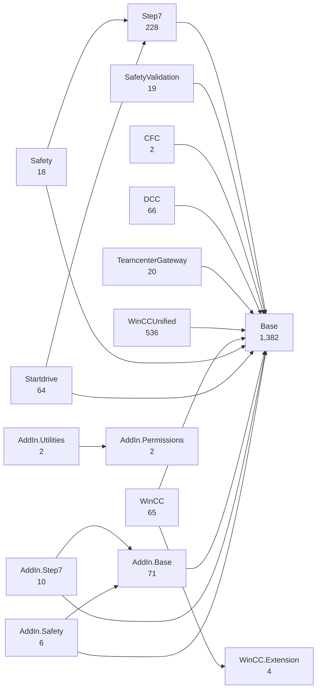
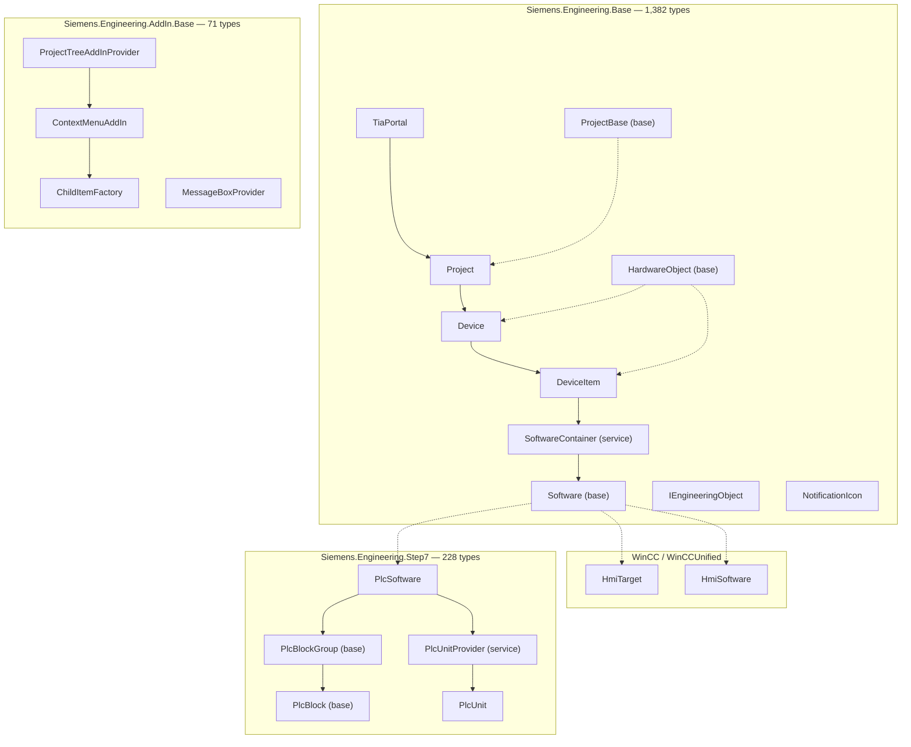
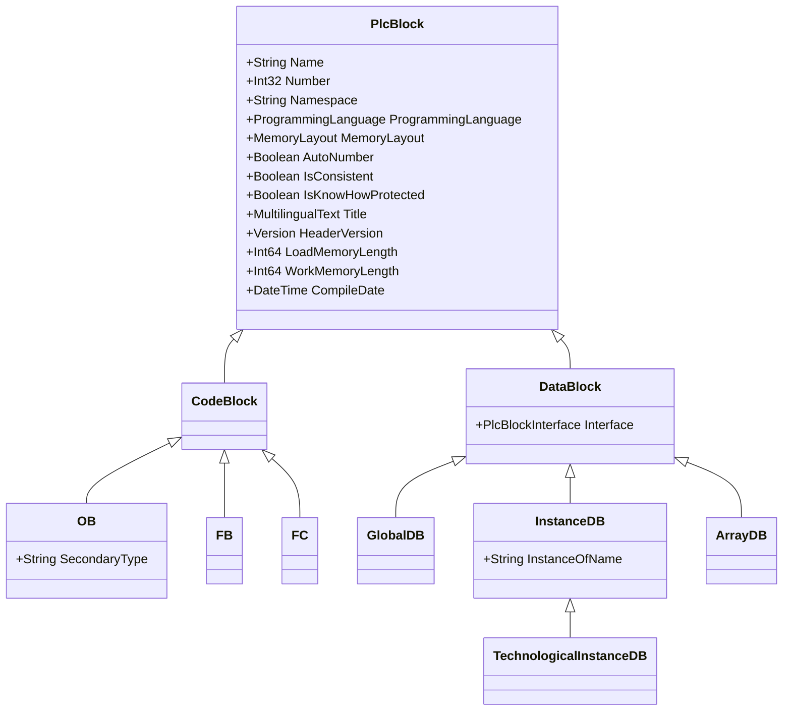
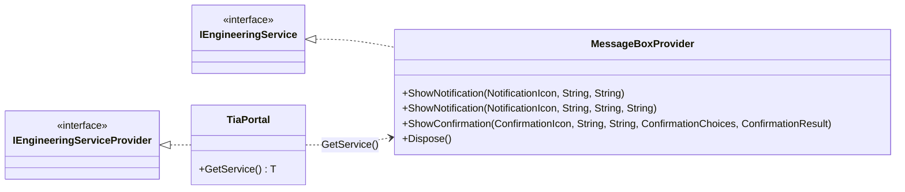

# TIA Portal V21 — Openness object model

**Read out of the assemblies, not out of the documentation.** V21 keeps almost every class shape intact and moves nearly all of them to a different file. That makes the interesting question not *what exists* but **what declares it** — which is what decides your references, and what breaks a binary that compiled fine.

|  |  |
| --- | --- |
| **Folder** | `PublicAPI\V21\net48\` |
| **Assemblies** | 16 |
| **Public types** | 2,495 |
| **Name collisions** | 0 |
| **Version / token** | `21.0.0.0` · `29bfe5fdf4ba5d3b` |
| **Method** | `Assembly.GetExportedTypes()` |
| **Read on** | 2026-09-04 |

> Its companion is **[TIA Portal V20 — Openness object model](TIA-Portal-V20-Openness-object-model.md)**, where the same model lives in a single assembly. Both pages follow the same section order, so they can be read side by side.

## What this covers, and what it leaves out

The model itself is documented on the V20 page and **is not repeated here**: seven of the eight spine types are the same surface, base class included, which is the headline finding rather than an omission. What this page covers is everything that is *different* — where each type now lives, what an Add-In has to reference, and the handful of real changes.

## Where the types live

Sixteen assemblies where V20 had one. Counted with `GetExportedTypes()` across every DLL in the folder; the four an Add-In is likely to reference are marked.

| Assembly | Types | Carries |
| --- | ---: | --- |
| **`Base`** ★ | 1,382 | the entire object model — `TiaPortal`, `Project`, `Device`, `DeviceItem`, `Software`, `IEngineeringObject`, `NotificationIcon`, `ExclusiveAccess` |
| `WinCCUnified` | 536 | the Unified HMI world, including `HmiSoftware` |
| **`Step7`** ★ | 228 | everything under `SW.*` — `PlcSoftware`, blocks, types, tags, software units |
| **`AddIn.Base`** ★ | 71 | the Add-In infrastructure and nothing else: providers, menus, `MessageBoxProvider` |
| `DCC` | 66 | drive control charts |
| `WinCC` | 65 | classic HMI, including `HmiTarget` |
| `Startdrive` | 64 | drive commissioning |
| `TeamcenterGateway` | 20 | PLM integration |
| `SafetyValidation` | 19 | safety validation reports |
| `Safety` | 18 | F-programs |
| `AddIn.Step7` | 10 | Add-In hooks specific to STEP 7 |
| `AddIn.Safety` | 6 | Add-In hooks specific to safety |
| `WinCC.Extension` | 4 | HMI extension points |
| **`AddIn.Utilities`** ★ | 2 | `Process` and `ProcessStartInfo` — two types, and one of the sharpest edges in the API |
| `AddIn.Permissions` | 2 | the permission attributes |
| `CFC` | 2 | continuous function charts |

**2,495 public types, and not one name collision.** Every full type name appears in exactly one assembly. That is the structural reason V21 never needs an `extern alias`, where V20 does the moment you add `Siemens.Engineering.dll` alongside the Add-In assembly and end up with two incompatible `IEngineeringObject` types.

### How the sixteen depend on each other

Every Siemens-to-Siemens reference, read from each assembly's own `GetReferencedAssemblies()`. `Contract` is left out of the drawing because thirteen of the sixteen reference it and the edges would bury everything else.

Arrows point at what an assembly depends on. **`Base` is the hub** — ten of the fifteen others reference it directly — and only three second-level dependencies exist in the whole product: `Safety` and `Startdrive` on `Step7`, and `WinCC` on `WinCC.Extension`.

> [!NOTE]
> **The island worth noticing.** `AddIn.Utilities` depends on `AddIn.Permissions` and on **nothing else** — not on `Base`, not even on `Contract`. Those two form a closed pair, which is why `Process` can be used without dragging the object model in, and why the public-key-token trap further down is so easy to walk into: the type has no other coupling to betray which version you are compiling against.

### What to reference

| To use | V20 reference | V21 reference |
| --- | --- | --- |
| Menus, providers | `AddIn` | `AddIn.Base` |
| `TiaPortal`, `Project`, `Device` | `AddIn` — already inside it | `Base` — a second reference |
| `PlcSoftware`, `PlcBlock`, units | `AddIn` — already inside it | `Step7` — a third reference |
| Launching an executable | `AddIn.Utilities` | `AddIn.Utilities` |
| HMI | `Hmi` | `WinCC` or `WinCCUnified` |

> [!IMPORTANT]
> **The inversion, in one line.** In V20 the Add-In assembly is **fat**: 2,269 types, the object model bundled in, and adding a second reference is what breaks you. In V21 it is **thin**: 71 types of pure infrastructure, and you *must* add more references or nothing compiles. Same goal, opposite instinct.

### Inheritance that crosses assemblies

Where the split is stitched back together: 64 public types derive from a base living in a different DLL.

| From | Into | Types | Examples |
| --- | --- | ---: | --- |
| `Step7` | `Base` | 27 | `PlcSoftware : Software`, `CodeBlockLibraryType : LibraryType`, the download configurations |
| `WinCC` | `Base` | 15 | `HmiTarget : Software`, the faceplate and script library types |
| `Startdrive` | `Base` | 10 | `DriveObjectContainer : DeviceItemFeature` |
| `DCC` | `Base` | 3 | `DccException : EngineeringTargetInvocationException` |
| `Startdrive` | `Step7` | 3 | `EncoderHardwareConnectionSDRProvider` |
| `WinCCUnified` | `Base` | 2 | `HmiSoftware : Software` |
| `Safety` | `Base` | 1 | `SafetyProgram : DownloadSelectionConfiguration` |
| `TeamcenterGateway` | `Base` | 1 | `TcGatewayException` |
| `AddIn.Step7` | `AddIn.Base` | 1 | `CaxWorkflowContext : WorkflowContext` |
| `AddIn.Safety` | `AddIn.Base` | 1 | `SafetyCompileContext : WorkflowContext` |

The three `Software` subclasses are the clearest case: `Software` is declared in `Base`, and its three implementations land in three *different* assemblies — `PlcSoftware` in `Step7`, `HmiTarget` in `WinCC`, `HmiSoftware` in `WinCCUnified`. That is why `SoftwareContainer.Software` can hand you back a type from an assembly you never referenced, and why the cast has to be guarded.

## The conventions that repeat

Unchanged from V20, and documented there: `XComposition` owns and creates, `XAssociation` only refers, every concern splits into an `XSystemGroup` and an `XUserGroup` over one `XGroup` base, and optional capabilities arrive through `GetService<T>()` — which returns `null` as a normal answer.

## The spine: portal to software

Same objects, same navigation, three different files. Nothing below changed shape in the move — only its address did.

Solid arrows are navigation, dashed are inheritance. **The whole object model sits in `Base`; everything PLC-shaped sits in `Step7`.** That boundary is the one to remember: the moment your code touches a `PlcBlock` or a software unit, you need a second reference.

## The group pattern

The same shape repeats for every kind of content a PLC holds, and once for devices up in `Base`. Learn it once and six more come free.

| Concern | Base class | The fixed root | The engineer's folders | Assembly |
| --- | --- | --- | --- | --- |
| Blocks | `PlcBlockGroup` | `PlcBlockSystemGroup` | `PlcBlockUserGroup` | `Step7` |
| Types | `PlcTypeGroup` | `PlcTypeSystemGroup` | `PlcTypeUserGroup` | `Step7` |
| Tag tables | `PlcTagTableGroup` | `PlcTagTableSystemGroup` | `PlcTagTableUserGroup` | `Step7` |
| External sources | `PlcExternalSourceGroup` | `PlcExternalSourceSystemGroup` | `PlcExternalSourceUserGroup` | `Step7` |
| Watch & force | `PlcWatchAndForceTableGroup` | `PlcWatchAndForceTableSystemGroup` | `PlcWatchAndForceTableUserGroup` | `Step7` |
| Technology objects | `TechnologicalInstanceDBGroup` | `TechnologicalInstanceDBSystemGroup` | `TechnologicalInstanceDBUserGroup` | `Step7` |
| Devices | `DeviceGroup` | `DeviceSystemGroup` | `DeviceUserGroup` | `Base` |

Seven for seven, with no exceptions — the split into a system group and a user group holds every time, and the recursion (`Groups`) always sits on the base class, so one recursive walk serves both kinds.

## Inside a PLC

The full inheritance tree under `PlcBlock`, with the members each level contributes. Two branches, four levels, and one of them exists purely to classify.

**`CodeBlock` declares no members of its own.** It exists to separate executable code from data, and nothing more — every property you use on an `FB` is inherited straight from `PlcBlock`. `DataBlock` earns its place by adding exactly one thing, `Interface`.

| Type | Derives from | Adds | Is |
| --- | --- | --- | --- |
| `PlcBlock` | `Object` | 25 properties — everything common to every block | the root |
| `CodeBlock` | `PlcBlock` | nothing | a classification only |
| `OB` | `CodeBlock` | `SecondaryType` | organisation block |
| `FB` | `CodeBlock` | nothing declared | function block |
| `FC` | `CodeBlock` | nothing declared | function |
| `DataBlock` | `PlcBlock` | `Interface` — a `PlcBlockInterface` | the DB branch |
| `GlobalDB` | `DataBlock` | nothing declared | global DB |
| `InstanceDB` | `DataBlock` | `InstanceOfName` | instance DB |
| `ArrayDB` | `DataBlock` | nothing declared | array DB |
| `TechnologicalInstanceDB` | `InstanceDB` | — | **a technology object is an instance DB** |

> [!NOTE]
> **The one that surprises people.** `TechnologicalInstanceDB` is **not** a sibling of the other DB kinds: it derives from `InstanceDB`, one level deeper. So an `is InstanceDB` test matches technology objects too, and any code that means "instance DBs but not technology objects" has to say so explicitly. It also lives in a different namespace, `SW.TechnologicalObjects`, while staying in the same assembly.

## Software units

Unchanged in shape from V20 — `PlcUnitProvider` arrives through `GetService()`, `PlcUnit` and `PlcSafetyUnit` derive from `PlcUnitBase`, and a unit repeats four of the PLC's group roots. The diagram is on the [V20 page](TIA-Portal-V20-Openness-object-model.md#software-units).

What changed is only the address: all of it now lives in `Step7`, not in the Add-In assembly.

## The Add-In surface

Also unchanged in shape, and drawn on the [V20 page](TIA-Portal-V20-Openness-object-model.md#the-add-in-surface). It moved to `AddIn.Base` — 71 types, infrastructure only — and that assembly references `Base` but **not** `Step7`, so an Add-In that touches a `PlcBlock` has to say so in its own references.

The Add-In infrastructure is also the one part of the API that kept every one of its abstract classes; see below.

## Across versions

### The shapes did not change

Declared properties compared member by member between the V20 assembly and the V21 one that now owns each type.

| Type | Base class | Declared properties |
| --- | --- | --- |
| `TiaPortal` | `Object` | identical |
| `HardwareObject` | `Object` | identical |
| `DeviceItem` | `HardwareObject` | identical |
| `SoftwareContainer` | `DeviceItemFeature` | identical |
| `PlcSoftware` | `Software` | identical |
| `PlcBlockGroup` | `Object` | identical |
| `PlcUnitBase` | `Object` | identical |
| `ProjectBase` | `Object` | **differs — see below** |

Seven of eight are byte-for-byte the same surface. This is why a port with one adapter per version costs so little: the adapters end up nearly identical, and the difference is an assembly reference rather than a rewrite.

### The members stayed — `abstract` did not

Same properties, same base classes, and yet the object model is declared differently. This one is invisible in a member-by-member comparison, which is exactly why it is worth stating.

| Type | V20 | V21 |
| --- | --- | --- |
| `ProjectBase` | abstract | concrete |
| `HardwareObject` | abstract | concrete |
| `Device` | abstract | concrete |
| `DeviceItem` | abstract | concrete |
| `DeviceGroup` | abstract | concrete |
| `Software` | abstract | concrete |
| `DeviceItemFeature` | abstract | concrete |
| `PlcBlock`, `CodeBlock`, `DataBlock` | abstract | concrete |
| `PlcBlockGroup`, `PlcTypeGroup` | abstract | concrete |
| `PlcUnitBase` | abstract | concrete |
| **`ProjectTreeAddInProvider`, `ContextMenuAddIn`, `MenuSelectionProvider`, `ActionItem`** | abstract | **abstract** |

It is not a handful of types. Counting every public class: **V20 declares 90 abstract classes out of 1,128; V21 declares 35 out of 1,254.** The modifier was dropped across the object model while the class count went up.

> [!NOTE]
> **The line the change respects.** The Add-In infrastructure kept every one of its abstract classes — the highlighted row above. So this is not a blanket edit: **the types you inherit from are still abstract, and the types you receive are no longer.** Which is coherent, since nothing was ever meant to subclass `Device` from outside.
>
> Practically it changes little, because you never construct these anyway: there are no public constructors and objects come from compositions. It matters if you reflect over the API, if you generate code from it, or if you wrote a test double by deriving from `Device` — which V20 forbade and V21 quietly allows.

### … except `ProjectBase`

Four properties leave, one arrives. None of this is a rename.

| Property | Status | Detail |
| --- | --- | --- |
| `Graphics` | **removed** | `MultiLingualGraphic` and its composition do not exist anywhere in V21 — the type is gone, not relocated |
| `PlantViews` | **removed** | Likewise: no `PlantView`, no `PlantViewComposition` in any of the sixteen assemblies |
| `IsSimulationDuringBlockCompilationEnabled` | **removed** | One of the two block-compilation flags, both gone from `ProjectBase` |
| `IsVirtualPlcDuringBlockCompilationEnabled` | **removed** | The other one |
| `TextCategories` | **added** | Returns `TextCategoryComposition`, declared in `Base` |

> [!WARNING]
> Code touching `project.Graphics` or `project.PlantViews` fails to compile against V21 — which is the good outcome. The bad one is a V20 Add-In still shipping those calls and nobody noticing until someone opens V21.

### The message box

The one divergence that actually bites in day-one code, because both versions have a message box and neither reaches it the same way.

V20 has an extension method, `tiaPortal.GetMessageBox()`, returning a type called `MessageBox`. **Neither exists in V21.** The replacement goes through the service mechanism, and `GetService` can return `null` — so the V21 path needs a guard the V20 path never did.

> [!NOTE]
> **Why this argues for a port.** Two lines of difference, in a call every action makes. Hidden behind one interface — `Info(caption, message)` — with one implementation per version, and no other file in the codebase ever learns that the versions disagree.

### Two references that are not in the folder

Read from every assembly's own reference list, then checked against the directory.

| Missing assembly | Referenced by | Which |
| --- | ---: | --- |
| `Siemens.Engineering.Contract` | 13 of 16 | `AddIn.Base`, `AddIn.Safety`, `AddIn.Step7`, `Base`, `CFC`, `DCC`, `Safety`, `SafetyValidation`, `Startdrive`, `Step7`, `TeamcenterGateway`, `WinCC`, `WinCCUnified` |
| `Siemens.Engineering.ClientAdapter.Interfaces` | 1 of 16 | `Base` |

Neither has blocked a build so far, because the compiler only needs a referenced assembly when a type from it appears in a signature you actually touch. The failure mode to recognise, if it ever comes, is *"is defined in an assembly that is not referenced"* — and the fix is to copy the missing DLL out of a TIA V21 installation, not to hunt for it in the Openness folder, where it is not shipped.

### Same name, same members, incompatible binary

The sharpest edge in the whole comparison, and the one with nothing in the source to warn you.

|  | V20 | V21 |
| --- | --- | --- |
| Assembly name | `Siemens.Engineering.AddIn.Utilities` | `Siemens.Engineering.AddIn.Utilities` |
| Type | `Utilities.Process` | `Utilities.Process` |
| Members | `Start` in four overloads, redirected stdio, `Exited`, `WaitForExit` | the same, member for member |
| **Public key token** | **`65b871d8372d6a8f`** | **`29bfe5fdf4ba5d3b`** |

> [!CAUTION]
> **Compiles once, loads once.** Everything about this type matches except the signature on the file that holds it. A single compiled binary binds to one identity and fails to load in the other host, so **source-identical code still has to be compiled twice**.
>
> The token is uniform across V21: all sixteen assemblies are `21.0.0.0` / `29bfe5fdf4ba5d3b`. It is the version boundary that separates identities, not the assembly boundary.

## How this was read

Read from the sixteen assemblies in `.lib\Siemens\PublicAPI\V21\net48\` and, for comparison, from `V20.addIn\Siemens.Engineering.AddIn.dll`, on 2026-09-04 via `GetExportedTypes()`, `GetProperties()` and `GetReferencedAssemblies()`.

Type counts fall back to the loadable subset where a missing dependency prevents a full load. Property comparisons are **declared-only**, so an inherited member is attributed to the class that declares it.

This page carries type names, member names and counts. **No Siemens code is reproduced**, which is what lets it live in the repository when the assemblies it describes may not: those require an Openness licence and are not redistributable.
